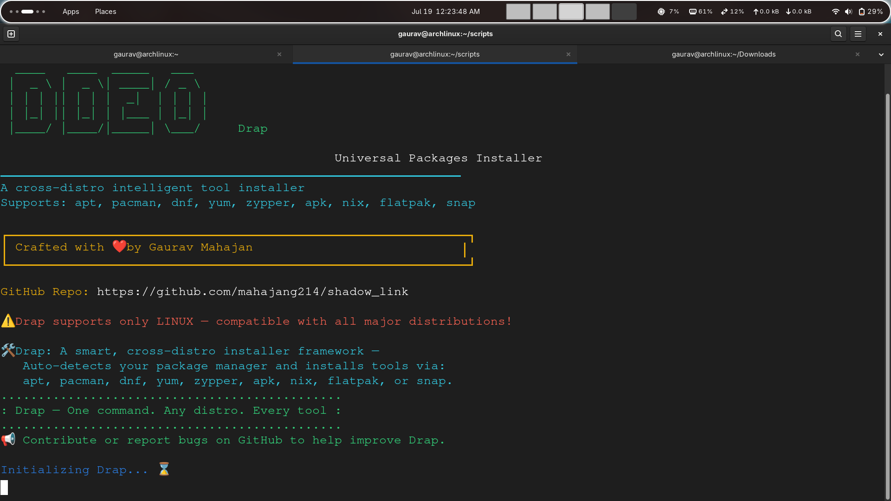
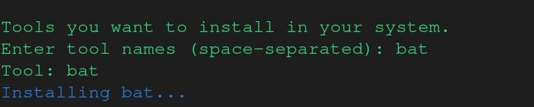
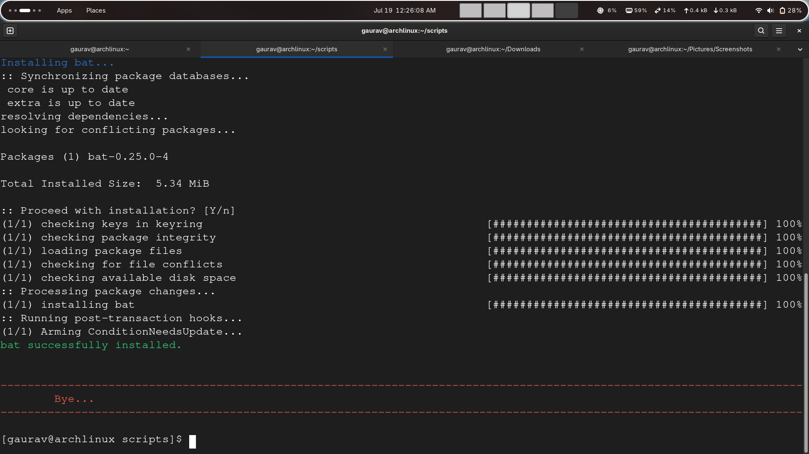

# Drap



**Drap** is a universal, cross-distro intelligent tool installer for Linux. It auto-detects your package manager and installs tools seamlessly, supporting all major Linux distributions and package managers.

---

## ✨ Features

- **Universal**: Works on any major Linux distro (Debian, Ubuntu, Arch, Fedora, openSUSE, Alpine, Nix, etc.)
- **Smart Detection**: Automatically detects your system's package manager (`apt`, `pacman`, `dnf`, `yum`, `zypper`, `apk`, `nix`, `flatpak`, `snap`)
- **Fallback Support**: Installs via Flatpak or Snap if native packages are unavailable
- **Easy to Use**: One command to install any tool
- **Beautiful CLI Banner**: Eye-catching ASCII art and colored output

---

## ⚡ Quick Start

```sh
# Clone the repository
git clone https://github.com/mahajang214/drap.git
cd drap

# Make the script executable
chmod +x drap.sh

# Run Drap
./drap.sh
```

## 📸 Screenshots

| Drap Menu                          | Installation Process                                  | Output Example                         |
| ---------------------------------- | ----------------------------------------------------- | -------------------------------------- |
|  |  |  |

---

## 🚀 Getting Started

### 1. Clone the Repository

```sh
git clone https://github.com/mahajang214/drap.git
cd drap
```
